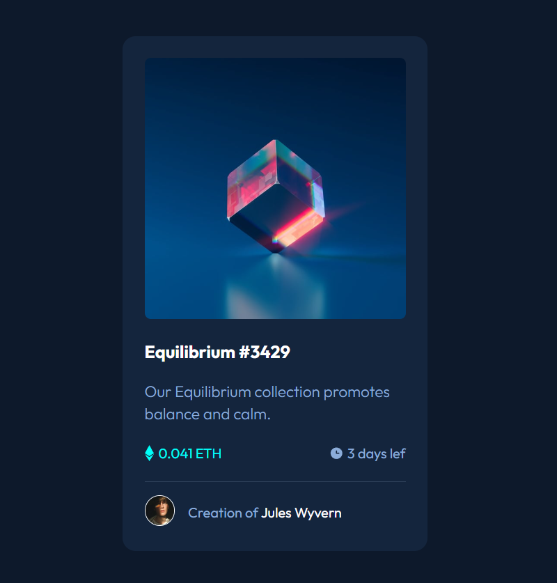

# Frontend Mentor - Solução de componente de cartão de perfil

Esta é uma solução para o [desafio do componente de cartão de perfil no Frontend Mentor](https://www.frontendmentor.io/challenges/profile-card-component-cfArpWshJ). Os desafios do Frontend Mentor ajudam você a melhorar suas habilidades de codificação construindo projetos realistas.

## Índice

- [Visão geral]
- [O desafio]
- [Captura de tela]
- [Links] 
- [O que aprendi] 
- [Agradecimentos] 


## Visão geral

### O desafio

- Crie o projeto de acordo com os designs fornecidos.
- Transições com posicionamento absoluto.

### Captura de tela



### Links

- URL da página no github: https://github.com/Wendel-Queiroz/workshop-nft-card.git
- URL do site ativo: https://wendel-queiroz.github.io/workshop-nft-card/

## Meu processo

### Criado com

- Marcação HTML5 semântica
- Propriedades personalizadas CSS
- Flexbox
- Grade CSS


### O que aprendi

Melhorei meu aprendizado sobre o position: absolute; 
E como adicionar os "active" em uma página;

Trechos de código em destaque, veja abaixo:

```html
<div class="creator">
                <p></p>
                <p class="text">Creation of <a href="#" class="name">Jules Wyvern</a></p>
            </div>
```
```css
.image-link::before{
    content: '';
    background-color: cyan;
    height: 100%;
    width: 100%;
    position: absolute;
    opacity: 0;
    transition: 0.3s ease-in-out;
}
```

### Desenvolvimento contínuo

Quero aprimorar ainda mais meu entendimento de posicionamento;
Aprimorar para que se torne algo cada vez mais fácil na hora de iniciar a estrutura de um projeto;
OS actives de uma página é algo que preciso me desenvolver;

### Recursos úteis

Link do projeto original: https://github.com/devemdobro/workshop-nft-card-inicial.git

## Agradecimentos

Agradecer a todos os envolvidos no projeto do curso Dev em Dobro, no qual me abriu as portas para esse universo de programação!